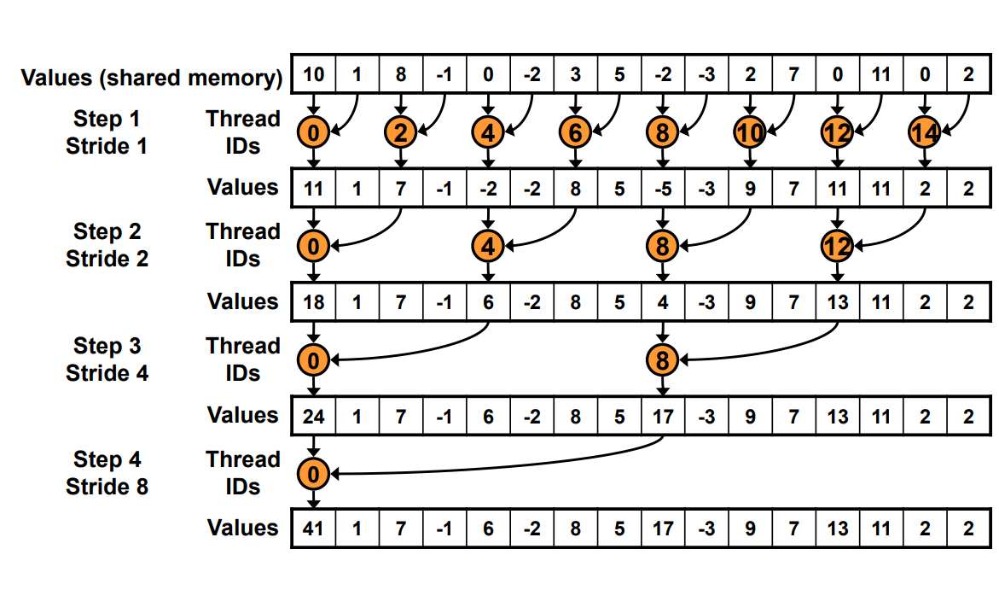
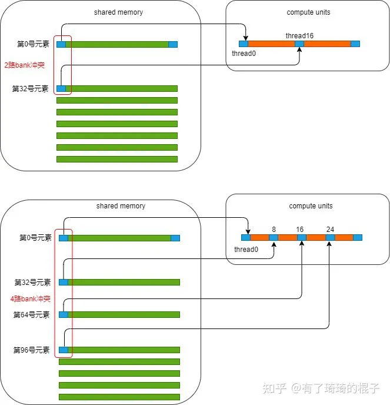
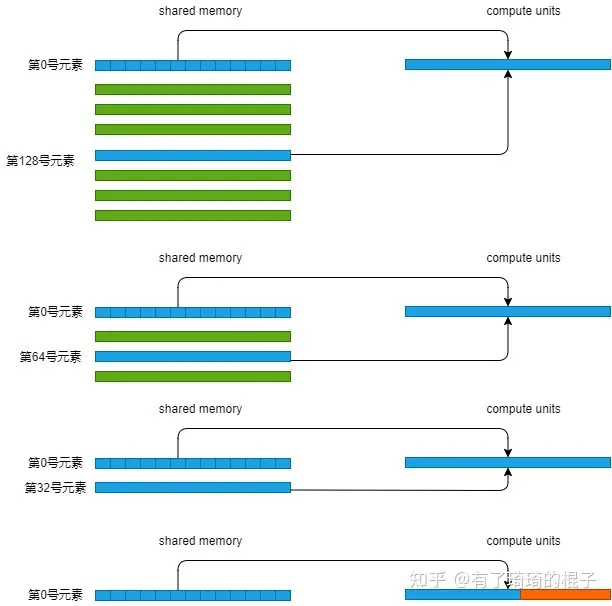
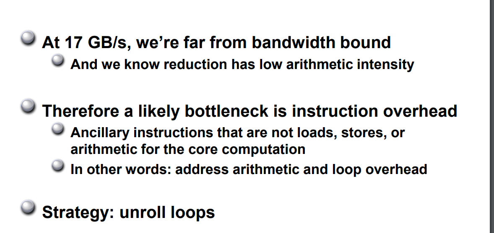

# reduce 优化入门

> 对cuda官方博客的学习和总结

## 背景

reduce操作是对一个数组求sum、min、max、avg等。reduce又称为规约，即递归约减，最终输出相比于输入一般在维度上会递减。

以reduce_sum问题为例，一个长度为8的数组求和之后得到的输出只有一个数，从1维数组变成一个标量。

## 硬件环境
NVIDIA GTX1650 峰值带宽，CUDA版本为11.8

## baseline

以树形图的方式去执行数据累加，最终得到总和。但是由于GPU没有对global memory的同步操作，所以分成多个阶段的方式来避免global memory的操作。如下：




算法实现：
```c++
__global__ void reduce_kernel_v0(float *g_idata, float *g_odata) {
  // 申请共享内存
  __shared__ float sdata[BLOCK_SIZE];

  // 每个线程从全局内存中读取一个数据到共享内存
  unsigned int tid = threadIdx.x;   // 线程id
  unsigned int i = blockIdx.x * blockDim.x + threadIdx.x;  // 全局id
  sdata[tid] = g_idata[i];  // 从全局内存中读取数据到共享内存

  __syncthreads();   // 同步， 这部分是一个潜在耗时的点

  // 在共享内存上做reduce
  for (unsigned int s = 1; s < blockDim.x; s *= 2) {
    if (tid % (2 * s) == 0) {
      sdata[tid] += sdata[tid + s];  // 每次将 (2k+1)s 加到 2ks上
    }
    __syncthreads();  // 同步
  }

  // 写结果到全局内存
  if (tid == 0) {
    g_odata[blockIdx.x] = sdata[0];
  }

}
```

g_idata表示输入数据的指针，而g_odata表示输出数据的指针。然后把global memory数据加载到shard memory中，接着在shared memory中对数据进行reduce_sum操作，最后将结果写入global memory中。

性能和带宽测试如下：

|      优化       | 耗时 (ms) | 带宽利用率 | 加速比 |
| :-------------: | :-------: | :--------: | :----: |
| reduce_baseline |   6.06    |   49.06%   |   ~    |


但baseline有明显的低效之处。
```c++
// 在共享内存上做reduce
  for (unsigned int s = 1; s < blockDim.x; s *= 2) {
    // 问题1：存在warp divergent
    // 问题2: %取模操作很慢
    if (tid % (2 * s) == 0) {
      sdata[tid] += sdata[tid + s];
    }
    __syncthreads();  // 同步
  }
```
有两个问题：
- 问题1：存在warp divergent
- 问题2: %取模操作很慢

> 什么是warp divergent？
> 在CUDA编程中，wrap divergent指的是在一个wrap中不同线程之间执行不同的代码路径(即分支语句的不同分支)，导致warp中的线程不能同时执行相同的指令，从而影响性能。
>
> 但一个warp中的线程执行分支语句，如果不是所有的线程都选择同一个分支路径，就会发生warp divergent。因为warp中的线程是以SIMD(Single Instruction Multiple Data)方式执行，每个线程必须执行相同的指令。如果不同的线程选择了不同的分支路径，就会出现某些线程被阻塞等待其他线程完成它们的操作，这就浪费了处理器的时间。


## 优化1  减少warp divergent

```c++
__global__ void reduce_kernel_v1(float *g_idata, float *g_odata) {
  // 申请共享内存
  __shared__ float sdata[BLOCK_SIZE];

  // 每个线程从全局内存中读取一个数据到共享内存
  unsigned int tid = threadIdx.x;   // 线程id
  unsigned int i = blockIdx.x * blockDim.x + threadIdx.x;  // 全局id
  sdata[tid] = g_idata[i];  // 从全局内存中读取数据到共享内存

  __syncthreads();   // 同步， 这部分是一个潜在耗时的点

  // 在共享内存上做reduce
  for (unsigned int s = 1; s < blockDim.x; s *= 2) {
    // 交错寻址
    int index = 2 * s * tid;
    if (index < blockDim.x) {
      sdata[index] += sdata[index + s];
    }
    __syncthreads();  // 同步
  }

  // 写结果到全局内存
  if (tid == 0) {
    g_odata[blockIdx.x] = sdata[0];
  }

}
```

针对baseline中的warp divergent问题进行优化。通过调整baseline中的分支判断代码，使得更多的线程可以走到同一个分支里边，从而降低资源浪费。

具体做法：把`if (tid % (2*s) == 0)` 替换成strided index的方式，即`int index = 2 * s * tid`, 然后判断index是否在当前的block内，虽然这份优化后的代码没有完全消除if语句，但可以减少产生的warp divergent次数:

对于第一次迭代，0-3号warp的index都是满足<blockDim.x的，而4-7号warp的index都是满足>=blockDim.x的，也就是说这次迭代根本不会出现warp divergent的问题，因为每个warp的32个线程执行的都是相同的分支。接下来对于第二代迭代，0，1两个warp是满足<blockDim.x的，其它warp则满足>=blockDim.x，依然不会出现warp divergent，以此类推直到第4次迭代时0号warp的前16个线程和后16线程会进入不同的分支，会产生一次warp divergent，接下来的迭代都分别会产生一次warp divergent。但从整体上看，这个版本的代码相比于BaseLine的代码产生的warp divergent次数会少得多。


性能和带宽测试如下：
|           优化           | 耗时 (ms) | 带宽利用率 | 加速比 |
| :----------------------: | :-------: | :--------: | :----: |
|     reduce_baseline      |   6.06    |   49.06%   |   ~    |
| reduce_v1_warp_divergent |   5.07    |   59.57%   | 1.195  |


## 优化2 解决bank conflict

使用shared memory有如下好处：
- 更低的延迟 (20 - 40倍)
- 更高的带宽 (~15倍)
- 更细的访问粒度，shared memory是4byte，global memory是32byte

但是shared memory的使用量存在一定上限，而使用shared memory要特别小心bank conflict。


我们把目光聚焦在这个for循环中。并且只聚焦在0号warp。在第一次迭代中，0号线程需要去load shared memory的0号地址以及1号地址的数，然后写回到0号地址。而此时，这个warp中的16号线程，需要去load shared memory中的32号地址和33号地址。可以发现，0号地址跟32号地址产生了2路的bank冲突。在第2次迭代中，0号线程需要去load shared memory中的0号地址和2号地址。这个warp中的8号线程需要load shared memory中的32号地址以及34号地址，16号线程需要load shared memory中的64号地址和68号地址，24号线程需要load shared memory中的96号地址和100号地址。又因为0、32、64、96号地址对应着同一个bank，所以此时产生了4路的bank冲突。现在，可以继续算下去，8路bank冲突，16路bank冲突。由于bank冲突，所以reduce1性能受限。下图说明了在load第一个数据时所产生的bank冲突。




**解决方法**

在reduce中，解决bank conflict的方式是for循环逆着。原来stride从0到256，现在stride从128到0.

伪代码如下：

```c++
__global__ void reduce_kernel_v2_bank_conflict(float *g_idata, float *g_odata) {
  // 申请共享内存
  __shared__ float sdata[BLOCK_SIZE];

  // 每个线程从全局内存中读取一个数据到共享内存
  unsigned int tid = threadIdx.x;   // 线程id
  unsigned int i = blockIdx.x * blockDim.x + threadIdx.x;  // 全局id
  sdata[tid] = g_idata[i];  // 从全局内存中读取数据到共享内存

  __syncthreads();   // 同步， 这部分是一个潜在耗时的点

  // 在共享内存上做reduce
  for (unsigned int s = blockDim.x / 2; s > 0; s >>= 1) {
    if (tid < s) {
      sdata[tid] += sdata[tid + s];
    }
    __syncthreads();  // 同步
  }

  // 写结果到全局内存
  if (tid == 0) {
    g_odata[blockIdx.x] = sdata[0];
  }

}
```

为什么这个改变能消除bank冲突：

把目光继续看到这个for循环中，并且只分析0号warp。0号线程需要load shared memory的0号元素以及128号元素。1号线程需要load shared memory中的1号元素和129号元素。这一轮迭代中，在读取第一个数时，warp中的32个线程刚好load 一行shared memory数据。再分析第2轮迭代，0号线程load 0号元素和64号元素，1号线程load 1号元素和65号元素。咦，也是这样，每次load shared memory的一行。再来分析第3轮迭代，0号线程load 0号元素和32号元素，接下来不写了，总之，一个warp load shared memory的一行。没有bank冲突。到了4轮迭代，0号线程load 0号元素和16号元素。那16号线程呢，16号线程啥也不干，因为s=16，16-31号线程啥也不干，跳过去了。示意图如下：




性能和带宽测试如下：
|           优化           | 耗时 (ms) | 带宽利用率 | 加速比 |
| :----------------------: | :-------: | :--------: | :----: |
|     reduce_baseline      |   6.06    |   49.06%   |   ~    |
| reduce_v1_warp_divergent |   5.07    |   59.57%   | 1.195  |
| reduce_v2_bank_conflict  |   4.05    |   74.67%   | 1.496  |


## 优化3 解决idle线程

reduce2中最大的问题是线程浪费。可以看到每个block中启动了256个线程，但实际并没有这么多线程在计算。

- 第一轮迭代只有[0, 127]的线程在计算，剩余[128, 255]的线程处于空闲状态。

- 第二轮迭代：只有[0, 63]的线程在进行计算，剩余[64, 255]个线程处于空闲状态。

随着迭代次数增加，参与计算的线程每次都在减半，并且[128, 255]线程除了一开始从global memory读取数据外再也没有参与过计算，一直处于空闲状态。

**解决方法**

将block数量减半，num_per_block翻倍，即一个block之前负责求和256个数，现在需要求和512个数。

在每个线程开始阶段从global memory取数据的时候可以直接进行一次从global[256, 511]到share memory[0, 255]的累加，这样的话block中的每个thread都至少进行了一次累加计算。

代码：
```c++
__global__ void reduce_kernel_v3_idle(float *g_idata, float *g_odata) {
  // 申请共享内存
  __shared__ float sdata[BLOCK_SIZE];

  // 每个线程从全局内存中读取一个数据到共享内存
  unsigned int tid = threadIdx.x;   // 线程id
  unsigned int i = blockIdx.x * blockDim.x * 2 + threadIdx.x;  // 全局id
  // sdata[tid] = g_idata[i];  // 从全局内存中读取数据到共享内存
  sdata[tid] = g_idata[i] + g_idata[i + blockDim.x];  // 从全局内存中读取数据到共享内存 一个线程读取两个数据

  __syncthreads();   // 同步

  // 在共享内存上做reduce
  for (unsigned int s = blockDim.x / 2; s > 0; s >>= 1) {
    if (tid < s) {
      sdata[tid] += sdata[tid + s];
    }
    __syncthreads();  // 同步
  }

  // 写结果到全局内存
  if (tid == 0) {
    g_odata[blockIdx.x] = sdata[0];
  }

}
```

性能和带宽测试如下：
|           优化           | 耗时 (ms) | 带宽利用率 | 加速比 |
| :----------------------: | :-------: | :--------: | :----: |
|     reduce_baseline      |   6.06    |   49.06%   |   ~    |
| reduce_v1_warp_divergent |   5.07    |   59.57%   | 1.195  |
| reduce_v2_bank_conflict  |   4.05    |   74.67%   | 1.496  |
|      reduce_v3_idlc      |   4.15    |   75.28%   | 1.460  |


> 官方博客中，该方式是有提升的，但是用gtx1650显卡实测的结果带宽利用率有提升，但是速度并没有提升。目前还不清楚原因是什么？

## 优化4 展开最后一个warp



意思是，对于reduce3，带宽利用率相比于理论带宽相差比较远，因为reduce操作不是算术密集型。因此，一个可能的瓶颈是指令的开销，这里的说的指令不是加载、存储或者给计算核心用的辅助指令。换句话说：这里的指令是地址算数指令和循环指令。

reduce3中，当s<=32时，此时block中只有一个warp0在干活，但线程还在进行同步操作。这一条语句造成了极大的指令浪费。由于一个warp的32个线程都是在同一个simd单元上，天然保持了同步的状态，因此当s<=32时，即只有一个warp工作时，可以把__syncthreads()语句去掉，使用手动展开的方式来代替。

代码：
```c++
__device__ void warpReduce(volatile float *sdata, int tid) {
  sdata[tid] += sdata[tid + 32];
  sdata[tid] += sdata[tid + 16];
  sdata[tid] += sdata[tid + 8];
  sdata[tid] += sdata[tid + 4];
  sdata[tid] += sdata[tid + 2];
  sdata[tid] += sdata[tid + 1];
}

__global__ void reduce_kernel_v4(float *g_idata, float *g_odata) {
  // 申请共享内存
  __shared__ float sdata[BLOCK_SIZE];

  // 每个线程从全局内存中读取一个数据到共享内存
  unsigned int tid = threadIdx.x;   // 线程id
  unsigned int i = blockIdx.x * (blockDim.x * 2) + threadIdx.x;  // 全局id
  // sdata[tid] = g_idata[i];  // 从全局内存中读取数据到共享内存
  sdata[tid] = g_idata[i] + g_idata[i + blockDim.x];  // 从全局内存中读取数据到共享内存 一个线程读取两个数据

  __syncthreads();   // 同步

  // 在共享内存上做reduce
  for (unsigned int s = blockDim.x / 2; s > 32; s >>= 1) {
    if (tid < s) {
      sdata[tid] += sdata[tid + s];
    }
    __syncthreads();  // 同步
  }
  if (tid < 32) warpReduce(sdata, tid);

  // 写结果到全局内存
  if (tid == 0) {
    g_odata[blockIdx.x] = sdata[0];
  }

}
```
> 注意: 这里的warpReduce函数的参数使用了一个volatile修饰符号，volatile中文的意思是不稳定的，对于用volatile修饰的变量，编译器对访问该变量的代码不再优化，总是从它所在的内存读取数据。
> 对于这个例子，如果不使用volatile，对于一个线程来说，它的s_data[tid]可能会被缓存在寄存器里边，且在某个时刻寄存器和shared_memory里面s_data[tid]的数值是不同的。当另一个线程读取s_data[tid]做加法的时候，也许直接就从shared_memory里边读取了旧的数值，从而导致错误的结果。详细参考：https://stackoverflow.com/questions/21205471/cuda-in-warp-reduction-and-volatile-keyword?noredirect=1&lq=1
>

TOOD: volatile的作用

性能和带宽测试如下：
|            优化            | 耗时 (ms) | 带宽利用率 | 加速比 |
| :------------------------: | :-------: | :--------: | :----: |
|      reduce_baseline       |   6.06    |   49.06%   |   ~    |
|  reduce_v1_warp_divergent  |   5.07    |   59.57%   | 1.195  |
|  reduce_v2_bank_conflict   |   4.05    |   74.67%   | 1.496  |
|       reduce_v3_idlc       |   4.15    |   75.28%   | 1.460  |
| reduce_v4_last_warp_unroll |   2.68    |   52.66%   | 2.261  |

> 这个地方我目前是有疑问的，nvidia的ppt指出这个kernel会继续提升性能和带宽，但是在我实测的时候发现性能确实继续提升了，但是带宽的利用率却下降了，目前想不清楚这个原因是什么？
>


## 优化5 完全展开循环

在 reduce_v4_unroll_last_warp kernel 的基础上就很难再继续优化了，但为了极致的性能NVIDIA的PPT上给出了对for循环进行完全展开的方案。

```c++
template <unsigned int blockSize>
__device__ void warpReduce(volatile float* cache, int tid) {
  if (blockSize >= 64) cache[tid] += cache[tid + 32];
  if (blockSize >= 32) cache[tid] += cache[tid + 16];
  if (blockSize >= 16) cache[tid] += cache[tid + 8];
  if (blockSize >= 8) cache[tid] += cache[tid + 4];
  if (blockSize >= 4) cache[tid] += cache[tid + 2];
  if (blockSize >= 2) cache[tid] += cache[tid + 1];
}

template <unsigned int blockSize>
__global__ void reduce_kernel_v5_for_unrolled(float *g_idata, float *g_odata) {
  // 申请共享内存
  __shared__ float sdata[BLOCK_SIZE];

  // 每个线程从全局内存中读取一个数据到共享内存
  unsigned int tid = threadIdx.x;   // 线程id
  unsigned int i = blockIdx.x * (blockDim.x * 2) + threadIdx.x;  // 全局id
  // sdata[tid] = g_idata[i];  // 从全局内存中读取数据到共享内存
  sdata[tid] = g_idata[i] + g_idata[i + blockDim.x];  // 从全局内存中读取数据到共享内存 一个线程读取两个数据

  __syncthreads();   // 同步

//   for (unsigned int s = blockDim.x / 2; s > 32; s >>= 1) {
//     if (tid < s) {
//       sdata[tid] += sdata[tid + s];
//     }
//     __syncthreads();  // 同步
//   }

  if (blockSize >= 512) {
    if (tid < 256) { sdata[tid] += sdata[tid + 256]; } __syncthreads();
  }
  if (blockSize >= 256) {
    if (tid < 128) { sdata[tid] += sdata[tid + 128]; } __syncthreads();
  }
  if (blockSize >= 128) {
    if (tid < 64) { sdata[tid] += sdata[tid + 64]; } __syncthreads();
  }

  if (tid < 32) warpReduce<blockSize>(sdata, tid);

  // 写结果到全局内存
  if (tid == 0) {
    g_odata[blockIdx.x] = sdata[0];
  }

}
```

性能和带宽测试如下：
|            优化            | 耗时 (ms) | 带宽利用率 | 加速比 |
| :------------------------: | :-------: | :--------: | :----: |
|      reduce_baseline       |   6.06    |   49.06%   |   ~    |
|  reduce_v1_warp_divergent  |   5.07    |   59.57%   | 1.195  |
|  reduce_v2_bank_conflict   |   4.05    |   74.67%   | 1.496  |
|       reduce_v3_idlc       |   4.15    |   75.28%   | 1.460  |
| reduce_v4_last_warp_unroll |   2.68    |   52.66%   | 2.261  |
|     reduce_for_unroll      |   2.59    |   54.60%   | 2.340  |

> 完全循环展开并没有明显的速度提升，并且带宽利用率提升也不明显。


## 优化6 调节blocksize和gridsize

可以通过调整GridSize和BlockSize的方式获得更好的性能收益，也就是说一个线程负责更多的元素计算。对应到代码的修改就是：

```c++
// warp展开
template <unsigned int blockSize>
__device__ void warpReduce(volatile float* cache, int tid) {
  if (blockSize >= 64) cache[tid] += cache[tid + 32];
  if (blockSize >= 32) cache[tid] += cache[tid + 16];
  if (blockSize >= 16) cache[tid] += cache[tid + 8];
  if (blockSize >= 8) cache[tid] += cache[tid + 4];
  if (blockSize >= 4) cache[tid] += cache[tid + 2];
  if (blockSize >= 2) cache[tid] += cache[tid + 1];
}

template <unsigned int blockSize, int NUM_PER_THREAD>
__global__ void reduce_kernel_v6(float *g_idata, float *g_odata) {
  // 申请共享内存
  __shared__ float sdata[BLOCK_SIZE];

  // 每个线程从全局内存中读取一个数据到共享内存
  unsigned int tid = threadIdx.x;   // 线程id
  unsigned int i = blockIdx.x * (blockDim.x * NUM_PER_THREAD) + threadIdx.x;  // 全局id
  // sdata[tid] = g_idata[i];  // 从全局内存中读取数据到共享内存
  // sdata[tid] = g_idata[i] + g_idata[i + blockDim.x];  // 从全局内存中读取数据到共享内存 一个线程读取两个数据
  sdata[tid] = 0;
  #pragma unroll
  for (int j = 0; j < NUM_PER_THREAD; j++) {
    sdata[tid] += g_idata[i + j * blockDim.x];
  }

  __syncthreads();   // 同步

//   for (unsigned int s = blockDim.x / 2; s > 32; s >>= 1) {
//     if (tid < s) {
//       sdata[tid] += sdata[tid + s];
//     }
//     __syncthreads();  // 同步
//   }

  if (blockSize >= 512) {
    if (tid < 256) { sdata[tid] += sdata[tid + 256]; } __syncthreads();
  }
  if (blockSize >= 256) {
    if (tid < 128) { sdata[tid] += sdata[tid + 128]; } __syncthreads();
  }
  if (blockSize >= 128) {
    if (tid < 64) { sdata[tid] += sdata[tid + 64]; } __syncthreads();
  }

  if (tid < 32) warpReduce<blockSize>(sdata, tid);

  // 写结果到全局内存
  if (tid == 0) {
    g_odata[blockIdx.x] = sdata[0];
  }

}
```

性能和带宽测试如下：
|            优化            | 耗时 (ms) | 带宽利用率 | 加速比 |
| :------------------------: | :-------: | :--------: | :----: |
|      reduce_baseline       |   6.06    |   49.06%   |   ~    |
|  reduce_v1_warp_divergent  |   5.07    |   59.57%   | 1.195  |
|  reduce_v2_bank_conflict   |   4.05    |   74.67%   | 1.496  |
|       reduce_v3_idlc       |   4.15    |   75.28%   | 1.460  |
| reduce_v4_last_warp_unroll |   2.68    |   52.66%   | 2.261  |
|    reduce_v5_for_unroll    |   2.59    |   54.60%   | 2.340  |
|  reduce_v6_multiple_adds   |  0.72166  |   98.36%   | 8.380  |

