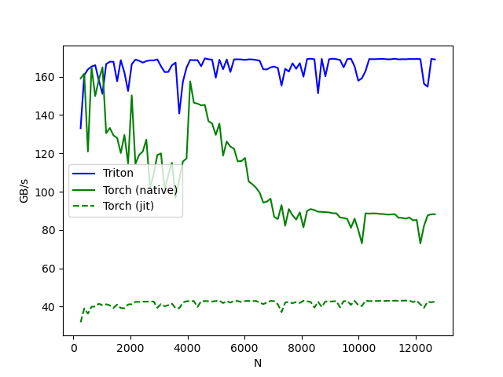

# 【OpenAI triton】softmax加速示例


## 前言
在上篇文章中[【OpenAI triton】快速入门教程](../triton_add_vector/add_vector.md)已经学习了triton的基础概念，并且实操了一个简单的例子：向量相加。本文会继续学习官方样例的第二个算子：fused_softmax。

## 算法思想
**原理：对矩阵的某一个特定维度进行 softmax 运算。**
softmax 运算用数学公式表示如下: 设输入向量为 $\mathbf{x}$ ，其可以表示为:

$$\mathbf{x}=\left[\begin{array}{llll}
x_1 & x_2 & \cdots & x_n
\end{array}\right]$$

同时，设向量 $\mathbf{x}^{\prime}$ 为

$$\mathbf{x}^{\prime}=\left[\begin{array}{llll}
x_1-\max (\mathbf{x}) & x_2-\max (\mathbf{x}) & \cdots & x_n-\max (\mathbf{x})
\end{array}\right]$$

减去最大元素避免溢出。最终的结果是等价的

那么， softmax 的计算公式如下:

$$\operatorname{softmax}(\mathbf{x})=\operatorname{softmax}\left(\mathbf{x}^{\prime}\right)=\left[\begin{array}{llll}
\frac{\exp \left(x_1^{\prime}\right)}{\operatorname{sum}\left(\mathbf{x}^{\prime}\right)} & \frac{\exp \left(x_2^{\prime}\right)}{\operatorname{sum}\left(\mathbf{x}^{\prime}\right)} & \cdots & \frac{\exp \left(x_n^{\prime}\right)}{\operatorname{sum}\left(\mathbf{x}^{\prime}\right)}
\end{array}\right]$$

基于pytorch接口实现一个基础版本：
```python
def native_row_softmax(input: Tensor):
    assert input.ndim == 2
    output = input - input.max(dim=1, keepdim=True)[0]
    output = torch.exp(output)
    output = output / output.sum(dim=1, keepdim=True)
    return output
```
基础版本的问题：从HBM中加载数据的次数过多。Pytorch框架下，每一步的计算结果会存储到HBM中，因此有几次pytorch的op操作，就有多少次数据加载。在上面的实现中，有 `max`, `sub`, `exp`, `sum` 和 `div` 五个操作，意味着有5次hbm的读写。同时, GPU 只在加载数据时进行缓存, 存储数据时不进行缓存, 那么在这里缓存功能是无用的。因此, 这样计算的效率非常低。

那么如何解决？如果使用CUDA，可以让一个线程块处理一行，预先数据加载到共享内存中，五步计算完再存储到HBM中，这样的操作被称为融合算子。其核心思想是减少HBM中加载和存储数据的次数。

但是这样也有问题，共享内存的大小是有限的。如果放不下一个行向量怎么办？
oneflow的一篇[博客](https://zhuanlan.zhihu.com/p/341059988)中给出了相关的解决方案：
1. 如果向量的元素个数小于 1024, 那么一个 warp 处理一个向量, 此时效率最高;
2. 如果向量的元素个数在 1024 到 4096 之间, 那么将向量预先加载到 共享内存 中, 一个 thread block 处理一个向量, 处理完成后再存储到 HBM 中;
3. 如果向量的元素个数大于 4096, 依旧是一个 thread block 处理一个向量, 只是会将中间的计算结果保存到 HBM 中, 和上面 PyTorch 代码的情况差不多。

在Triton中，也采用了类似的策略，只不过不需要手动实现，triton编译器会自动优化。再次感叹triton的易用

## 代码实现

### 核函数
```python
@triton.jit
def softmax_kernel(output_ptr, input_ptr, input_row_stride, output_row_stride, n_cols, BLOCK_SIZE: tl.constexpr):
    # softmax 的行是独立的，所以我们在这些行上并行化
    row_idx = tl.program_id(0)
    # 步长表示我们需要增加指针的数量以前进1行
    row_start_ptr = input_ptr + row_idx * input_row_stride
    # 块大小是大于 n_cols 的下一个2的幂，这样我们可以将每
    # 行适配在单个块中
    col_offsets = tl.arange(0, BLOCK_SIZE)
    input_ptrs = row_start_ptr + col_offsets
    # 使用掩码将行加载到SRAM中，因为 BLOCK_SIZE 可能大于 n_cols
    row = tl.load(input_ptrs, mask=col_offsets < n_cols, other=-float('inf'))
    # 减去最大值以保证数值稳定性
    row_minus_max = row - tl.max(row, axis=0)
    # 注意，在 Triton 中指数运算是快速但近似的（即，想象在 CUDA 中的 __expf）
    numerator = tl.exp(row_minus_max)
    denominator = tl.sum(numerator, axis=0)
    softmax_output = numerator / denominator
    # 将输出写回到 DRAM
    output_row_start_ptr = output_ptr + row_idx * output_row_stride
    output_ptrs = output_row_start_ptr + col_offsets
    tl.store(output_ptrs, softmax_output, mask=col_offsets < n_cols)
```
核心思想是一个program处理一个行向量。用 `M` 和 `N` 分别表示行向量的个数以及行向量中元素的个数。那么一共需要启动 `M` 个program。
一个program需要处理一个行向量中所有元素， `row_idx` 是行坐标索引， `col_offsets` 是元素列坐标索引
需要注意，因为 `tl.load` 函数加载的元素个数必须是2的幂，因此在主机函数中，需要将 `BLOCK_SIZE_N` 设置为 `triton.next_power_of_2(N)` 。
`triton.next_power_of_2` 计算并返回大于或等于给定数字的最小的 `2` 的幂。
有了坐标，就可以计算`input_ptrs`和`output_ptrs`。

> 小插曲：tl.load加载的数据量有最大值，是2^20，可以通过tl.TRITON_MAX_TENSOR_NUMEL查看。如果数据的类型是float，那么一共需要4MB的内存，这个数字远远大于共享内存的大小。根据推测，triton编译器应该采用了和oneflow一样的优化策略。如果将N设置的非常大，就会发现，运行时间异常的长，同时GPU使用率异常低，这是因为和HBM交互过多导致的。
>
> 产生的原因是：没办法将单个向量的softmax运算拆分为多个子softmax运算。虽然没有办法拆分，但是还可以优化的，相关内容在后续的博客中介绍（透露以下，flashattention中将softmax进行优化）。


### 主机函数
```python
def fused_softmax(x):
    n_rows, n_cols = x.shape
    # 块大小是大于 `x` 中列数的最小2的幂
    BLOCK_SIZE = triton.next_power_of_2(n_cols)
    # 另一个我们可以使用的技巧是要求编译器通过
    # 增加每行分布的 warps 数量（`num_warps`）来使用更多线程。
    num_warps = 4
    if BLOCK_SIZE >= 2048:
        num_warps = 8
    if BLOCK_SIZE >= 4096:
        num_warps = 16
    # 分配输出
    y = torch.empty_like(x)
    # 启动内核。1D启动网格很简单：输入矩阵的每一行分配一个 kernel 实例
    softmax_kernel[(n_rows, )](
        y,
        x,
        x.stride(0),
        y.stride(0),
        n_cols,
        num_warps=num_warps,
        BLOCK_SIZE=BLOCK_SIZE,
    )
    return y
```

## 测试
### 单元测试
```python
torch.manual_seed(0)
x = torch.randn(1823, 781, device='cuda')
y_triton = softmax(x)
y_torch = torch.softmax(x, axis=1)
assert torch.allclose(y_triton, y_torch), (y_triton, y_torch)
结果和torch.softmax一致
```
### 性能测试
和torch.softmax、navie_softmax比较：
```python
@triton.testing.perf_report(
    triton.testing.Benchmark(
        x_names=['N'],  # 用作图表x轴的参数名
        x_vals=[128 * i for i in range(2, 100)],  # `x_name`的不同可能值
        line_arg='provider',  # 其值对应图表中不同线条的参数名
        line_vals=[
            'triton',
            'torch-native',
            'torch-jit',
        ],  # `line_arg`的可能值
        line_names=[
            "Triton",
            "Torch (native)",
            "Torch (jit)",
        ],  # 线条的标签名
        styles=[('blue', '-'), ('green', '-'), ('green', '--')],  # 线条样式
        ylabel="GB/s",  # y轴的标签名
        plot_name="softmax-performance",  # 图表的名称。也用作保存图表的文件名。
        args={'M': 4096},  # 不在`x_names`和`y_name`中的函数参数值
    ))
def benchmark(M, N, provider):
    x = torch.randn(M, N, device='cuda', dtype=torch.float32)
    # quantiles = [0.5, 0.2, 0.8]
    if provider == 'torch-native':
        ms = triton.testing.do_bench(lambda: torch.softmax(x, axis=-1))
    if provider == 'triton':
        ms = triton.testing.do_bench(lambda: fused_softmax(x))
    if provider == 'torch-jit':
        ms = triton.testing.do_bench(lambda: naive_softmax(x))
    gbps = lambda ms: 2 * x.nelement() * x.element_size() * 1e-9 / (ms * 1e-3)
    return gbps(ms)

benchmark.run(save_path="softmax_performance/", print_data=True)
```

<center>
    
</center>
结论：

- triton的吞吐量显著高于原生torch
- triton比torch jit快四倍，说明torch jit内部没有做融合操作
