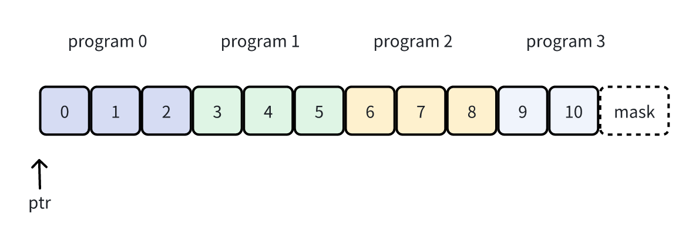

# 【OpenAI triton】快速入门教程


## 简介
最近很多工作都是基于Triton完成或者提供了相关实现版本，比如Flash attention等，
本文会简要介绍triton是什么，然后实操一个小例子：向量相加，（没错，在cuda编程学习中，也会以这个例子作为入门，学习基础的GPU并性思维）。

### 了解triton (非triton server)
在深度学习中, 有两个项目都命名成 Triton: 一个是英伟达开源的推理框架 Triton Inference Server; 另一个就是本文的主角: OpenAI 开源的 AI 编译器 Triton。

编译器的本质就是代码转换器。我们一般将 开发者 写的代码称为 编程语言 (programming language)。编程语言 分为两种: 一种是 GPL (general-purpose language), 可以进行通用领域的开发, 常见的有 C/C++, Java, Python 等等; 另一种是 DSL (domain-specific language), 只能针对特定领域进行开发。DSL 的语法一般是不完善的, 会依附于某个 GPL 之上, 方便进行扩展。

计算机可以识别运行的代码称为机器码, 而编译器的工作就是将 编程语言 转换成 机器码。当然, 这个过程是非常繁琐的, 需要兼容各式各样的硬件设备, 编译器也不会一步将 编程语言 转换成 机器码, 而是需要经过多个步骤 (多层抽象)。我们将每一步得到的代码称为 中间表示 (Intermediate representation), 简称 IR。整个转换过程是: 编程语言 (GPL/DSL) → 中间表示 → 机器码。

Triton 属于 AI 编译器, 其提供的 编程语言 是针对深度学习领域算子融合的, 因此被称为 DSL。
早期 Triton 提供的 DSL 是基于 C/C++ 语言; 而现在则是基于 Python 语言, 进一步降低开发门槛。同时, Triton 现在和 PyTorch 生态相互融合:
- Triton 的官方实现目前只支持融合 PyTorch 算子
- torch.compile 的 TorchInductor 后端中 CUDA 部分是基于 Triton 开发的

Triton 采用 just-in-time 机制进行编译。如果一个函数被 triton.jit 装饰器装饰, 那么在运行时会先编译成机器码, 然后再执行。我们将被 triton.jit 装饰的函数称为核函数。

Triton的编译过程如下:
- 将 核函数 解析成 AST (抽象语法树)
- 根据 AST 生成 Triton IR 代码
- 将 Triton IR 代码转换成 Triton GPU IR 代码
- 将 Triton GPU IR 代码转换成 LLVM IR 代码
- 使用 LLVM, 将 LLVM IR 代码转换成 PTX 代码
- 使用 ptxas, 将 PTX 代码转换成 cubin 机器码

> 在 Triton 2.0+ 中, 作者使用 MLIR (Multi-Level Intermediate Representation) 重写了后端。

从上面可以看出, 整个编译过程不涉及到 CUDA 代码转换, 而是多层 中间表示 的转换, 最终得到 cubin 机器码。

因此, 我们可以认为, Triton 和 CUDA 是同一层次的概念, 但是适用的范围不同: 前者是针对深度学习领域的 GPU 计算, 而后者是针对通用领域的 GPU 计算。

> 在Triton中，没有了CUDA中的grid，block和thread等概念，出现了programs的概念。programs和grid(blocks)的概念和相似。在CUDA中，核函数是针对一个thread而言的，开发者可以精准的控制每一个thread的执行，而在triton中，核函数是针对每一个program而言的，开发者使用类似于Numpy的向量化编程方式来写代码。至于一个program怎么对应到多个thread上，那是triton编译器做的事情，和开发者无关。triton编译器底层会做大量的优化，这对开发者无感，极大降低了开发门槛，实现了运行效率和开发难度之间的平衡。
> refs：https://zhuanlan.zhihu.com/p/697626885

### 安装
现在安装 PyTorch 2.0+ 的版本, 都会自带triton。如果需要单独安装triton，操作如下：
```bash
pip install triton
```

## 入门示例--向量相加
本节会介绍Triton编程模型定义kernel的基本写法，并介绍怎么实现benchmark基准测试。由浅入深的揭开triton的面纱。

> 实现参考triton官方教程， https://triton-lang.org/main/getting-started/installation.html

### 算法思想
向量相加指：向量对应位置的元素相加，如下：
$$[x_1, x_2, ..., x_n] + [y1, y2, ..., y_n] = [x_1 + y_1, x2 + y_2, ..., x_n + y_n]$$

朴素实现：
```python
for x, y in zip(X, Y):
    out = x + y
```
如果向量的长度很大，那么这种串行计算逻辑会比较耗时。对于GPU，可以很容易的支持向量加的并行计算：每个thread计算一个简单的元素相加，多个thread之间并行。了解了基本的并行思路，下边会思考如何提高并行效率。

在GPU中，数据的加载与存储消耗的时间通常比实际计算要多几倍。因此，减少数据读写开销，是一个重要的优化点。L1 cache 属于片上内存，用来存放常用的数据，包括共享内存、常量内存等，而L2 cache属于片外内存，其主要存放HBM中数据的缓存。当前很多算子常用的做法是：将数据预加载到共享内存中，尽可能的减少从HBM中加载数据的次数。

综上，一个显而易见的实现思路是：预加载数据到共享内存中，将计算才分为简单的元素相加，分配给不同的thread，thread之间并行计算，最终将结果输出。

下边，一步步分析如何实现两个向量的逐位相加。

### 实现
#### 核函数编写
首先, 导入必要的包, 代码如下:
```python
import torch
from torch import Tensor

import triton  # 只能用于 主机函数
import triton.language as tl  # 只能用于 核函数
```
需要说明的是:
- Triton 目前官方只支持 PyTorch 算子融合, 所以 torch 包必须导入
- 在 核函数 中, 我们只能使用 `tl` 中提供的函数, 或者被 `triton.jit` 装饰的函数, 其它函数都不能调用
- 在 核函数 之外, 不能使用 `tl` 中提供的函数, 可以使用 triton 提供的函数

核函数代码：
```python
@triton.jit
def _vector_add_kernel(
        a_ptr, b_ptr, c_ptr, M,        # c = a + b, 其中, a, b 和 c 的 shape 都是 [M, ]
        stride_a, stride_b, stride_c,  # a, b, c 向量的 stride
        BLOCK_SIZE: tl.constexpr       # meta 参数
):
    """ 每一个 program 处理 [BLOCK_SIZE, ] 大小的数据 """

    # pid: 当前 program 的索引值
    pid = tl.program_id(axis=0)

    # offsets: 当前 program 需要处理元素的 坐标索引
    offsets = pid * BLOCK_SIZE + tl.arange(0, BLOCK_SIZE)

    # ptrs: 当前 program 需要处理元素的内存地址
    a_ptrs = a_ptr + offsets * stride_a
    b_ptrs = b_ptr + offsets * stride_b

    # 加载数据并计算
    a = tl.load(a_ptrs, mask=offsets < M, other=0.0)
    b = tl.load(b_ptrs, mask=offsets < M, other=0.0)
    c = a + b

    # 保存数据
    c_ptrs = c_ptr + offsets * stride_c
    tl.store(c_ptrs, c, mask=offsets < M)
```
triton编译器会将tensor参数转换为数组首元素的指针。
如果一个参数类型是`tl.constexpr`, 那么这个参数是`meta`参数，`meta`参数要求：必须是2的幂。`meta`参数和数据的加载息息相关，直接影响计算的性能，后边会说为什么。

triton中programs其实是一个三维数组，在CUDA中，通过`blockIdx.x, blockIdx.y, blockIdx.z`,来获取一个block的坐标索引，而在triton中，通过`tl.program_id(axis=0), tl.program_id(axis=1), tl.program_id(axis=2)`来获取一个program的坐标索引。

设向量的size是`M`，现在对向量进行分block操作（注意：这里是单纯的分块，和cuda中的block没有关系），每个block有`BLOCK_SIZE`个元素，那么一共有`ceil(M/BLOCK_SIZE)`个block，每一个program负责一个block的数据。下图可以辅助理解：
<center>
    
</center>

在上述代码中，a和b是输入张量，c是输出张量。运算前需要将输出张量的内存预先分配好。单个program需要做的事情是：从a张量和b张量中加载`BLOCK_SIZE`个元素，并进行逐位相加，存储到c张量中。

`tl.arange` 和 `torch.arange` 是一样的, 返回一个向量。`pid * BLOCK_SIZE` 就是当前 program 处理的 block 首元素的 坐标索引。 因此, `offsets` 就是 block 中每一个元素的 坐标索引。坐标索引 乘以 `stride` 就是 全局索引, 和 `ptr` 相加就是元素的 "指针"。那么, `a_ptrs`, `b_ptrs` 和 `c_ptrs` 就是 block 中所有元素的 "指针"。

`tl.load` 负责从 HBM 中加载数据, 加载到 共享内存 或者 本地内存 中。具体加载到哪由 Triton 编译器控制。需要注意的是, 加载数组的个数必须是 2 的幂。这个限制和 `meta` 参数的要求是一致的, 也正是因为此, `meta` 参数主要用于计算 `offsets。如果` `M` 不能被 `BLOCK_SIZE` 整除, 那么最后一组就需要设置 `mask` 和 `other` 参数。`mask `参数表示当前位置是否需要加载, `other` 参数表示空缺位置的填充值。

际的计算过程只有一行代码: `c = a + b`。`tl.store `负责将计算结果存储到 HBM 中, 和 `tl.load` 是相互对应的操作。


#### 主机函数编写
核函数开发完成后，需要编写代码启动启动核函数。
```python
def vector_add(
        input1: Tensor, input2: Tensor, block_size: int = 1024,
        print_ir: bool = False, ir_type: str = "llir", print_meta: bool = False
) -> Tensor:

    assert input1.is_cuda and input2.is_cuda
    assert input1.ndim == 1 and input2.ndim == 1 and input1.size(0) == input2.size(0)

    vector_size = input1.size(0)
    output = torch.zeros_like(input1)

    block_size = triton.next_power_of_2(block_size)
    num_programs = triton.cdiv(vector_size, block_size)
    programs_shape = (num_programs, )

    compiled_kernel: triton.compiler.CompiledKernel = _vector_add_kernel[programs_shape](
        input1, input2, output, vector_size, input1.stride(0), input2.stride(0), output.stride(0), block_size
    )

    if print_ir:
        print("Triton GPU IR codes of add kernel are shown below:", )
        print(compiled_kernel.asm[ir_type])
        print()

    if print_meta:
        print("The meta parameters of add kernel are shown below:",)

        while True:  # 等待程序运行完成
            if isinstance(compiled_kernel.metadata, dict):
                print(json.dumps(compiled_kernel.metadata, ensure_ascii=False, indent=4, skipkeys=True))
                break

    return output
```
首先, Triton 提供了两个非常实用的函数: `next_power_of_2(n)` 返回大于 n 最小 2 的幂;` cdiv(x, y)` 等价于 `ceil(x / y)`。它们可以帮助我们高效的计算 `meta` 参数值, 以及 programs 的 `shape` 值。

其次, 就是 核函数 的启动方式为: `kernel_func[programs_shape_tuple](*args)`, 这个明显是仿照 CUDA 核函数的启动方式设计的。需要注意的是, 中括号中必须是元组, 不能是单个数字!

之前说过, 在 Triton 中, 核函数 采用 JIT 编译方式。当 核函数 启动完成后, 编译也就完成了。一般情况下, 编译的过程只会发生在第一次调用时, 或者 `meta` 参数值发生变化时。其它时候, 核函数 都不会进行编译。

核函数 启动完成后, 会返回的 CompiledKernel 对象。这个对象中包含编译后的信息: `asm` 属性包含了编译后的 中间表示 代码以及 机器码, 包括: `ttir, ttgir, llir, ptx 以及 cubin`; `metadata` 属性包含编译的其它一些信息。

需要注意的是, 核函数 启动完成, 只代表其编译完成, 并向 GPU 发送了计算指令, 不能说明 GPU 计算完成 。

至此，已经使用triton实现了向量相加计算。

### 测试
#### 正确性测试
```python
torch.manual_seed(0)
    size = 98432
    x = torch.rand(size, device='cuda')
    y = torch.rand(size, device='cuda')
    output_torch = x + y
    output_triton = vector_add(x, y)
    print(output_torch)
    print(output_triton)
    print(f'The maximum difference between torch and triton is '
        f'{torch.max(torch.abs(output_torch - output_triton))}')
```
输出结果:
```
tensor([0.4185, 1.2900, 0.8900,  ..., 0.5681, 1.1120, 0.8088], device='cuda:0')
tensor([0.4185, 1.2900, 0.8900,  ..., 0.5681, 1.1120, 0.8088], device='cuda:0')
The maximum difference between torch and triton is 0.0
```

#### 速度测试
```python
@triton.testing.perf_report(
    triton.testing.Benchmark(
        x_names=["size"],  # size 是 x 轴
        x_vals=[2 ** i for i in range(12, 28, 1)],  # 从 2^12 到 2^28
        x_log=True,  # x 轴使用 log10 显示
        line_arg="provider",
        line_vals=["triton", "torch"],  # 一条曲线
        line_names=["Triton", "Torch"],  # 曲线名称
        styles=[('blue', '-'), ("green", "-")],
        ylabel="GB/s",
        plot_name="vector_add_performance",
        args={}
    ))

def benchmark(size, provider):
    x = torch.rand(size, device='cuda')
    y = torch.rand(size, device='cuda')
    quantiles = [0.5, 0.2, 0.8]
    if provider == "torch":
        ms, min_ms, max_ms = triton.testing.do_bench(lambda: x + y, quantiles=quantiles )
    elif provider == "triton":
        ms, min_ms, max_ms = triton.testing.do_bench(lambda: vector_add(x, y), quantiles=quantiles)

    gbps = lambda ms: 3 * x.numel() * x.element_size() * 1e-6 / ms

    return gbps(ms), gbps(max_ms), gbps(min_ms)
```
传递 print_data=True 参数来查看性能数据，传递 show_plots=True 参数来绘制图表，和/或传递 save_path='/path/to/results/' 参数来将它们连同原始CSV数据一起保存到磁盘上：
```python
benchmark.run(print_data=True, show_plots=True)
```

<center>
    
</center>
